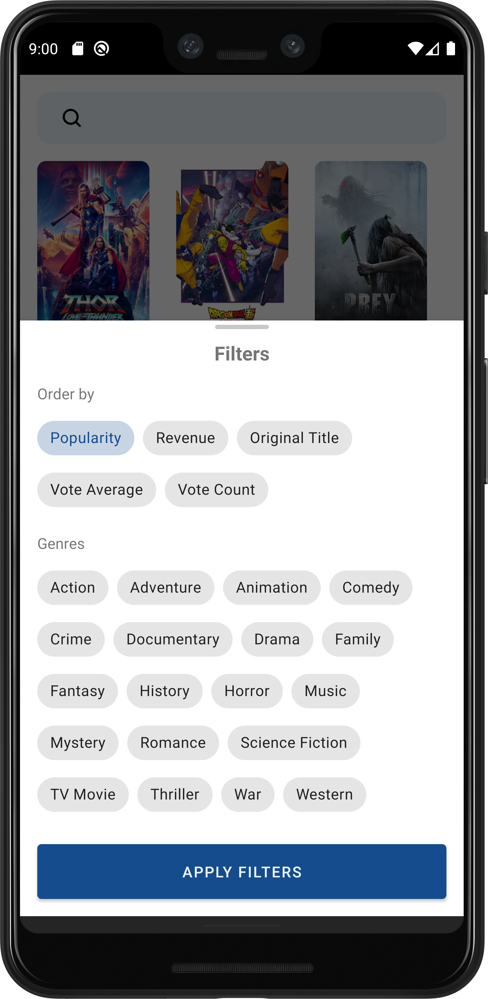

# TMDb
A simple Android app built in Kotlin that is based on TMDB API to display current information about movies. It helps to explore trending, now playing and top-rated movies. Also, it provides ability to discover movies using filters, search by title and add films to local collection for easy remembrance. This app is built following Repository Pattern, MVVM Architecture in the presentation layer as well as jetpack components.

## Tech Stack
- [Dagger Hilt](https://github.com/google/hilt)
- [Jetpack](https://developer.android.com/jetpack)
    - [Android KTX](https://developer.android.com/kotlin/ktx.html)
    - [AndroidX](https://developer.android.com/jetpack/androidx)
    - [Lifecycle](https://developer.android.com/topic/libraries/architecture/lifecycle)
    - [LiveData](https://developer.android.com/topic/libraries/architecture/livedata)
    - [ViewModel](https://developer.android.com/topic/libraries/architecture/viewmodel)
    - [Room](https://developer.android.com/training/data-storage/room)
    - [Navigation Component](https://developer.android.com/guide/navigation/navigation-getting-started)
    - [Paging 3](https://developer.android.com/topic/libraries/architecture/paging/v3-overview)
 - [Retrofit](https://square.github.io/retrofit/) 
 - [GSON](https://github.com/square/gson)
 - [OkHttp-Logging-Interceptor](https://github.com/square/okhttp/blob/master/okhttp-logging-interceptor/README.md)
 - [Kotlin Coroutines](https://developer.android.com/kotlin/coroutines)
 - [Kotlin Flow](https://developer.android.com/kotlin/flow)
 - [Glide](https://github.com/bumptech/glide)
 - [Material Design](https://material.io/develop/android/docs/getting-started/)

## Demo
   
  
